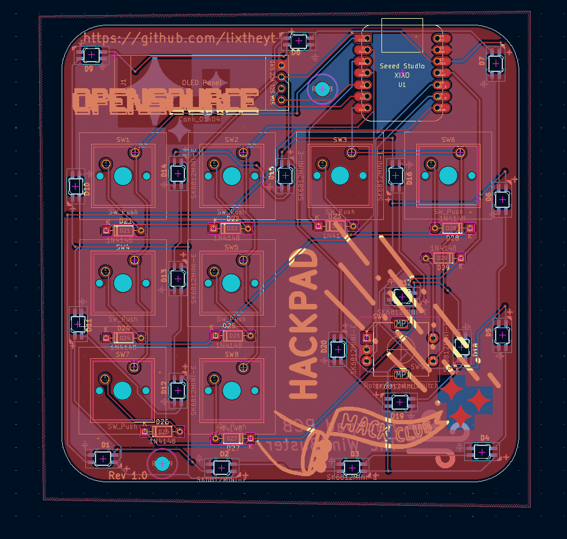

# mediapad

A 9-key media macropad: 8 Cherry MX switches plus an EC11 rotary encoder with a
push switch, a 128x32 SSD1306 OLED and 20 SK6812 MINI-E underglow LEDs, driven
by a Seeed XIAO RP2040.

* Keyboard Maintainer: [Lix](https://github.com/lixtheyt)
* Hardware Supported: mediapad PCB + XIAO RP2040
* Hardware Availability: https://github.com/lixtheyt/mediapad

Make example for this keyboard (after setting up your build environment):

    make mediapad:lixtheyt

Flashing example for this keyboard:

    make mediapad:lixtheyt:flash

See the [build environment setup](https://docs.qmk.fm/#/getting_started_build_tools) and the [make instructions](https://docs.qmk.fm/#/getting_started_make_guide) for more information. Brand new to QMK? Start with our [Complete Newbs Guide](https://docs.qmk.fm/#/newbs).

## Bootloader

Enter the bootloader in 3 ways:

* **Bootmagic reset**: Hold down the top left key (rewind) and plug in the keyboard
* **Physical reset button**: Double-tap the reset button on the XIAO RP2040
* **Key combo**: Hold rewind + fast-forward + mute for 5 seconds
